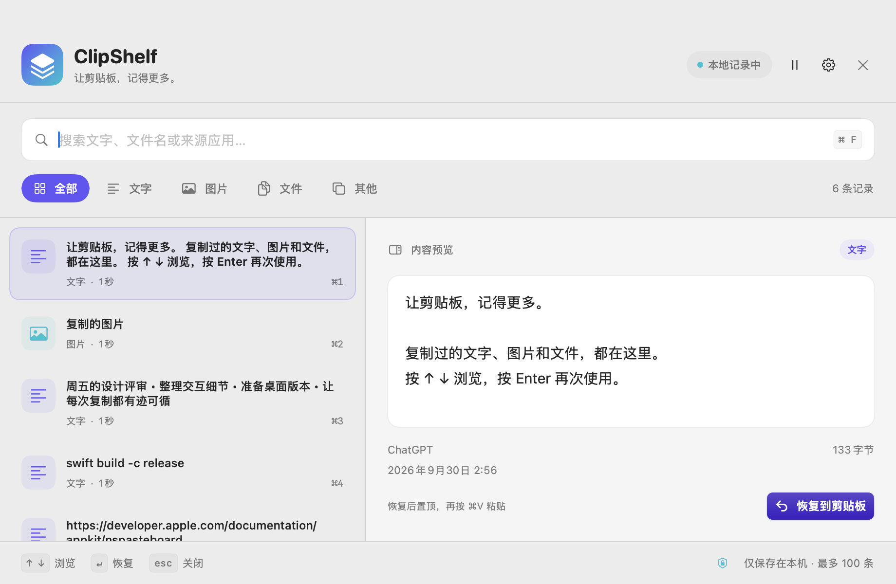

# ClipShelf · Mac 剪贴板历史

按一下快捷键，把之前复制过的文字、图片或文件找回来。ClipShelf 是 macOS 原生菜单栏应用：上下预览、回车选择，选中的内容立即回到系统剪贴板，并成为历史中的最新一条。

延续 [video_cut](https://github.com/SeanLi-Coder/video_cut) 的本地工具方式：源码可读、双击启动、数据留在自己的 Mac。使用 Swift / AppKit / SwiftUI 构建，无第三方依赖、无服务器、无账号。



## 下载和启动

需要 **macOS 13 Ventura 或更新版本**。

### 直接使用 App

1. 打开 [GitHub Releases](https://github.com/SeanLi-Coder/clipboard/releases/latest)，下载与你的 Mac 对应的 ZIP：Apple Silicon（M1/M2/M3/M4 等）选择 `arm64`，Intel 选择 `x86_64`。
2. 解压，把 `ClipShelf.app` 拖到「应用程序」。
3. 打开 ClipShelf，菜单栏会出现剪贴板图标。复制一些内容后，按 **⌘⇧V** 打开历史窗口。

发布包使用 ad-hoc 签名，尚未使用 Apple Developer ID 签名或完成公证。如果 macOS 阻止首次打开，请先确认文件来自本仓库，再按 Apple 提供的方法，在「系统设置 → 隐私与安全性」选择「仍要打开」。详见 [Apple 官方说明](https://support.apple.com/zh-cn/102445)。

### 从源码双击启动

下载并解压仓库，或执行：

```bash
git clone https://github.com/SeanLi-Coder/clipboard.git
cd clipboard
```

首次需要 Apple Command Line Tools；尚未安装时执行一次，并等待系统安装完成：

```bash
xcode-select --install
```

之后双击 **`start.command`**。脚本会编译并打开 `dist/ClipShelf.app`，启动完成后可以关闭 Terminal 窗口。也可以在 Terminal 中执行：

```bash
./start.command
```

菜单栏中选择退出即可停止，也可以双击 `stop.command`。没有安装额外的后台服务。

## 使用方式

| 操作 | 默认快捷键 / 方法 |
|---|---|
| 打开历史选择窗口 | **⌘⇧V**，可在设置修改 |
| 选择更早或更新的记录 | **↑ / ↓** |
| 还原选中内容，并移到历史第一条 | **Return** 或点击还原按钮 |
| 关闭窗口 | **Esc** |
| 不打开窗口，逐次还原更早的历史 | **⌘⌥V**，可在设置修改；连续按可循环浏览 |
| 直接还原历史第 1～9 条 | 可选 **⌃⌥1…9**，默认关闭 |
| 还原窗口中当前筛选结果的第 1～9 条 | 窗口内按 **⌘1…9** |
| 查找记录 | 窗口内按 **⌘F** 聚焦搜索，查找文字、文件名或来源 App |
| 调整历史数量、快捷键等 | 打开菜单栏中的设置 |

例如依次复制 A、B、C，历史顺序就是 C、B、A。在窗口选中 A 后按 Return，系统剪贴板变成 A，历史顺序变成 A、C、B。回到要输入的 App，按 **⌘V** 即可使用 A。选择图片、文件或视频文件时也是同样的操作。

「直接还原上一条」会记住开始循环时的历史顺序。历史为 C、B、A，当前剪贴板为 C 时，连续按 ⌘⌥V 会按 **C → B → A → C** 的顺序循环；每次恢复的内容也会移到历史第一条。新复制内容或通过窗口另选内容后，会从更新后的历史重新开始循环。

默认只还原剪贴板。若希望选择后直接粘贴到之前使用的 App，可在设置开启「自动粘贴」，并按系统要求授予「辅助功能」权限。普通的记录、选择和还原不需要此权限。自动粘贴相当于向目标 App 发送 ⌘V，是否接收该内容由目标 App 决定。

## 支持的内容

| 内容 | 行为 |
|---|---|
| 普通文字、链接、代码 | 显示文字预览，并支持搜索 |
| 富文本 | 保存剪贴板中的富文本表示；是否保留格式取决于粘贴目标 |
| 截图、复制的图片 | 显示图片预览，恢复为图片剪贴板内容 |
| Finder 中复制的一个或多个文件 | 保留文件引用，恢复后可以在 Finder 或支持文件粘贴的 App 中使用 |
| 视频文件 | 作为文件记录，支持预览；恢复后按文件粘贴 |

文件历史保存的是原文件的位置，**不会复制或备份原文件本身**。移动、删除原文件或断开外置磁盘后，该记录可能无法恢复。文件恢复按「复制」处理，不重放 Finder 的剪切 / 移动状态。来自某些 App 的私有剪贴板格式或延迟生成的数据，可能无法跨 App 重放。

## 设置和数据

- 历史数量默认 **100 条**，可以设置为 **10～1000 条**；降低数量会立即移除较旧记录。
- 单条剪贴板数据超过 **32 MiB** 时直接不收录，系统剪贴板保持原样。全部历史数据上限为 **256 MiB**，超过总容量或设置的条数时淘汰最旧记录。文件仅保存引用，因此视频文件本身的大小不计入剪贴板数据量。
- 内容相同的复制会更新原记录的位置，避免堆积重复记录。
- 支持暂停记录、删除单条和清空历史；清空历史不会清空系统当前剪贴板。
- 可以选择「登录时启动」。建议先把 App 放到「应用程序」，再开启；系统是否批准可在 macOS「登录项」中查看。
- 启动前已经在系统剪贴板中的内容不会自动收录；启动后新复制的内容才会进入历史。运行时每 0.5 秒检查一次剪贴板，退出期间的复制不会被记录；半秒内连续变化的中间状态可能无法捕获。

历史保存在当前用户目录：

```text
~/Library/Application Support/ClipShelf/
```

历史只存放在本机，不上传、不收集遥测、不放进 Git 仓库。历史文件不是加密保险箱；普通文本也可能包含敏感内容。应用会跳过标记为密码、隐私或临时内容的剪贴板，但不能识别所有来源的敏感文字；需要时可暂停记录或清空历史。

如果历史文件损坏或版本不受支持，应用会先将原文件保留为同目录的 `history.unreadable-UUID.plist`，避免直接覆盖；无法保留时不会写入新历史。设置中的「清空历史」也会删除这些本地恢复备份。

## 开发与打包

App 支持 macOS 13 或更新版本，源码构建需要 Apple Command Line Tools 和 Swift 5.9 或更新版本。运行 Swift Testing 测试需要 **macOS 14 或更新版本、Swift 6 或更新版本**；测试 SDK 的要求不改变 App 的最低系统版本。脚本明确调用 `/usr/bin/xcrun swift`，避免与其他同名命令冲突。

```bash
# Run tests.
./scripts/test.sh

# Build an ad-hoc signed app.
./scripts/build.sh

# Run an isolated startup smoke test.
dist/ClipShelf.app/Contents/MacOS/ClipShelf --smoke-test

# Build a release ZIP and SHA-256 checksum.
./scripts/package.sh

# Build for a specific architecture.
./scripts/package.sh --arch x86_64

# Override the release version.
CLIPSHELF_VERSION=1.0.1 CLIPSHELF_BUILD_NUMBER=2 ./scripts/package.sh
```

`scripts/test.sh` 自动兼容 Command Line Tools 和完整 Xcode，也可以透传 `--parallel`、`--filter` 等参数。只安装 Command Line Tools 时，它会指定 Swift Testing 的 framework / macro 路径并使用 native build system。

构建产物位于 `dist/ClipShelf.app`；发布文件名包含版本和架构，例如 `ClipShelf-1.0.0-macOS-arm64.zip` 与同名 `.sha256`。在下载文件夹中校验：

```bash
shasum -a 256 -c ClipShelf-1.0.0-macOS-arm64.zip.sha256
```

图标由 `scripts/generate-icon.swift` 使用 AppKit 向量绘制，构建时按需生成 `.icns`，无需下载素材。GitHub Actions 分别在 Apple Silicon 和 Intel macOS runner 上执行测试、构建、启动检查并提供 ZIP artifact。Runner 标签依据 [GitHub 官方文档](https://docs.github.com/en/actions/reference/runners/github-hosted-runners) 配置。

手动验收步骤见 [docs/TESTING.md](docs/TESTING.md)。GitHub CI 验证结果以仓库 Actions 页面为准；编译和自动检查不能替代不同 macOS 版本、目标 App 与辅助功能授权的实机验证。

## License

[MIT](LICENSE)。
